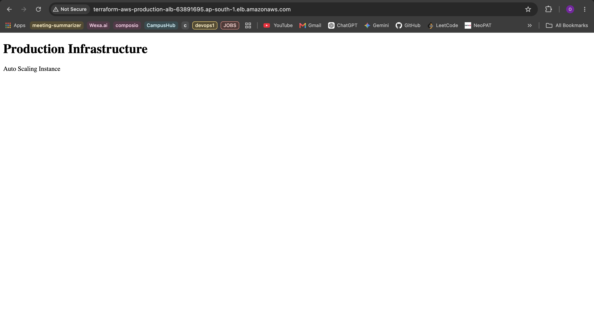
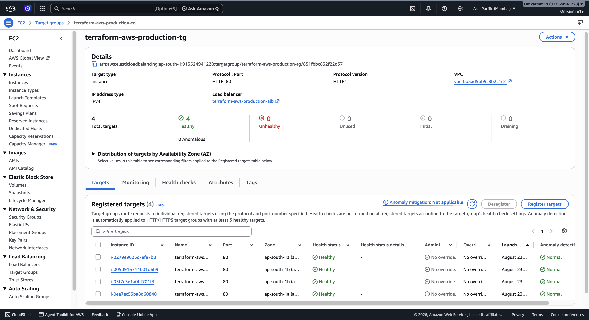
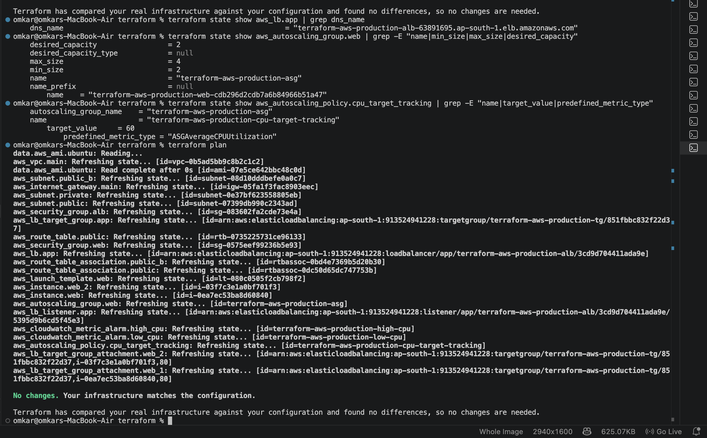

# Production-Ready AWS Infrastructure with Terraform

A production-oriented AWS infrastructure project built using **Terraform, Docker, GitHub Actions, Application Load Balancer, Auto Scaling, and CloudWatch**.

The project demonstrates Infrastructure as Code, containerized application deployment, load balancing, automatic scaling, security hardening, monitoring, and CI/CD on AWS.

---

## Architecture

```text
                         Internet
                            |
                            v
                  +-------------------+
                  | Application       |
                  | Load Balancer     |
                  |      (ALB)        |
                  +---------+---------+
                            |
                     Target Group
                            |
              +-------------+-------------+
              |                           |
              v                           v
      +---------------+           +---------------+
      |   EC2 Web 1   |           |   EC2 Web 2   |
      |    Docker     |           |    Docker     |
      +---------------+           +---------------+
              \                           /
               \                         /
                +-----------------------+
                          |
                 Auto Scaling Group
                 Min: 2 | Desired: 2
                 Max: 4
                          |
                 CPU Target Tracking
                     Target: 60%
                          |
                          v
                    CloudWatch
                 Metrics & Alarms
```

### Network Architecture

```text
AWS VPC: 10.0.0.0/16
|
+-- Public Subnet A
|      10.0.1.0/24
|
+-- Public Subnet B
|      10.0.3.0/24
|
+-- Private Subnet
       10.0.2.0/24
```

---

## Overview

This project provisions and manages AWS infrastructure entirely through Terraform.

The infrastructure includes:

- Custom VPC and subnet architecture
- Internet Gateway and routing
- EC2 application servers
- Dockerized web application
- Application Load Balancer
- Target Group with health checks
- Auto Scaling Group
- CPU-based target tracking
- CloudWatch monitoring and alarms
- Security Group hardening
- GitHub Actions CI/CD
- End-to-end infrastructure validation

The complete infrastructure is version-controlled and reproducible using Terraform.

---

## Key Features

### Infrastructure as Code

Terraform is used to provision and manage the AWS infrastructure.

Benefits include:

- Repeatable deployments
- Version-controlled infrastructure
- Consistent configuration
- Infrastructure validation through `terraform plan`
- Easier infrastructure changes

### Application Load Balancer

An Application Load Balancer provides the public entry point for the application and distributes traffic across healthy EC2 instances.

### Auto Scaling

The Auto Scaling Group maintains application capacity based on the configured limits:

| Configuration | Value |
|---|---:|
| Minimum | 2 |
| Desired | 2 |
| Maximum | 4 |
| CPU Target | 60% |

### Monitoring

CloudWatch is used for infrastructure monitoring with:

- High CPU alarm
- Low CPU alarm
- ASG CPU target tracking

### Containerized Application

The web application runs inside Docker containers on EC2 instances using an Nginx-based image.

### CI/CD

GitHub Actions automates application deployment to EC2 whenever changes are pushed to the configured branch.

### Security Hardening

Web-server access is restricted so that:

- HTTP traffic is accepted from the ALB security group
- SSH access is restricted to the configured administrator IP
- Public direct HTTP/HTTPS access to the web-server security group is removed

---

## Tech Stack

| Category | Technology |
|---|---|
| Cloud | AWS |
| Infrastructure as Code | Terraform |
| Compute | Amazon EC2 |
| Networking | VPC, Subnets, Route Tables, Internet Gateway |
| Load Balancing | Application Load Balancer |
| Scaling | Auto Scaling Group |
| Monitoring | Amazon CloudWatch |
| Containers | Docker |
| CI/CD | GitHub Actions |
| Operating System | Ubuntu 24.04 |
| Version Control | Git, GitHub |

---

## AWS Resources

The Terraform configuration manages resources including:

```text
VPC
Subnets
Internet Gateway
Route Table
Security Groups
EC2 Instances
Launch Template
Application Load Balancer
Target Group
ALB Listener
Auto Scaling Group
Auto Scaling Policy
CloudWatch Metric Alarms
```

---

## Project Structure

```text
terraform-aws-production-infrastructure/
│
├── app/
│
├── diagrams/
│
├── docs/
│
├── screenshots/
│   ├── phase-1-networking/
│   ├── phase-2-ec2/
│   ├── phase-3-terraform/
│   ├── phase-4-app/
│   ├── phase-5-cicd/
│   ├── phase-6-alb/
│   ├── phase-7-autoscaling/
│   ├── phase-8-security/
│   ├── phase-9-monitoring/
│   └── phase-10-validation/
│
├── terraform/
│   ├── main.tf
│   ├── variables.tf
│   ├── outputs.tf
│   └── provider.tf
│
├── .github/
│   └── workflows/
│
├── LICENSE
└── README.md
```

---

## Prerequisites

Install the following:

- AWS CLI
- Terraform
- Docker
- Git
- AWS account
- EC2 SSH key pair

Verify installations:

```bash
terraform --version
aws --version
docker --version
git --version
```

Configure AWS credentials:

```bash
aws configure
```

---

## Deployment

### 1. Clone the repository

```bash
git clone <repository-url>
cd terraform-aws-production-infrastructure
```

### 2. Initialize Terraform

```bash
cd terraform
terraform init
```

### 3. Format the configuration

```bash
terraform fmt
```

### 4. Validate the configuration

```bash
terraform validate
```

### 5. Review the infrastructure plan

```bash
terraform plan
```

### 6. Apply the infrastructure

```bash
terraform apply
```

Review the plan and confirm the deployment when prompted.

---

## Terraform Commands

### Initialize

```bash
terraform init
```

### Format

```bash
terraform fmt
```

### Validate

```bash
terraform validate
```

### Plan

```bash
terraform plan
```

### Apply

```bash
terraform apply
```

### View Outputs

```bash
terraform output
```

### List Resources

```bash
terraform state list
```

### Inspect a Resource

```bash
terraform state show <resource>
```

### Destroy Infrastructure

```bash
terraform destroy
```

> Use `terraform destroy` only when the infrastructure is no longer required.

---

## CI/CD Pipeline

The project uses GitHub Actions to automate application deployment.

```text
Developer
    |
    | git push
    v
GitHub Repository
    |
    v
GitHub Actions
    |
    +--> Checkout repository
    |
    +--> Configure SSH
    |
    +--> Copy application to EC2
    |
    +--> Build Docker image
    |
    +--> Stop previous container
    |
    +--> Start new container
    |
    +--> Verify deployment
    |
    v
Running Application
```

The deployment workflow uses repository secrets for sensitive connection information.

No private SSH credentials are stored directly in the repository.

---

## Load Balancing

The Application Load Balancer provides a single public entry point for the application.

Traffic is forwarded to the target group containing the application instances.

Health checks are configured on the target group so that unhealthy instances can be removed from traffic.

---

## Auto Scaling

The Auto Scaling Group is configured with:

```text
Minimum capacity: 2
Desired capacity: 2
Maximum capacity: 4
```

CPU Target Tracking is configured with:

```text
Metric: ASGAverageCPUUtilization
Target: 60%
```

This allows the Auto Scaling Group to automatically adjust capacity based on average CPU utilization.

---

## Monitoring

CloudWatch metric alarms are configured for:

### High CPU

Monitors average CPU utilization and detects sustained high CPU usage.

### Low CPU

Monitors average CPU utilization and detects sustained low CPU usage.

The alarms provide infrastructure visibility while the Auto Scaling target-tracking policy handles automatic capacity adjustment.

---

## Security

The infrastructure uses separate security groups for the ALB and web servers.

### ALB Security Group

Allows:

```text
HTTP : 80
Source: Internet
```

### Web Server Security Group

Allows:

```text
HTTP : 80
Source: ALB Security Group

SSH : 22
Source: Administrator IP
```

Outbound traffic is allowed for required application and infrastructure operations.

This prevents direct public HTTP access to the web-server security group while allowing application traffic through the load balancer.

---

## Validation

The infrastructure was validated using Terraform and AWS services.

### Terraform Validation

```bash
terraform fmt
terraform validate
terraform plan
```

Final validation result:

```text
Success! The configuration is valid.

No changes. Your infrastructure matches the configuration.
```

### Infrastructure Validation

The following were verified:

- ALB DNS accessibility
- Target Group health
- EC2 instances
- Auto Scaling Group capacity
- CPU Target Tracking policy
- CloudWatch alarms
- Security Group configuration
- Dockerized application
- End-to-end application request through the ALB

---

## Screenshots

### Application Through ALB



### Healthy Target Group



### Final Terraform Validation



Additional implementation evidence is available in the phase-wise screenshot directories:

```text
screenshots/
```

---

## Project Phases

The infrastructure was implemented incrementally:

| Phase | Implementation |
|---|---|
| Phase 1 | AWS Networking |
| Phase 2 | EC2 Infrastructure |
| Phase 3 | Terraform Infrastructure as Code |
| Phase 4 | Application Containerization |
| Phase 5 | GitHub Actions CI/CD |
| Phase 6 | Application Load Balancer |
| Phase 7 | Auto Scaling |
| Phase 8 | Security Hardening |
| Phase 9 | CloudWatch Monitoring |
| Phase 10 | Final Infrastructure Validation |

Each phase contains supporting implementation evidence in the `screenshots/` directory.

---

## Future Improvements

Potential future improvements include:

- Remote Terraform state using Amazon S3
- Terraform state locking
- Reusable Terraform modules
- HTTPS with AWS Certificate Manager
- Route 53 domain integration
- AWS WAF
- IAM roles instead of long-lived credentials
- Private EC2 instances behind the ALB
- NAT Gateway for private subnet outbound access
- Amazon ECR for container images
- Rolling or blue/green deployments
- Centralized logging
- Advanced observability
- Terraform security scanning
- Separate development, staging, and production environments

---

## Author

**Omkar Mahesh**

B.Tech Computer Science & Engineering, Cloud Computing & Automation

**Focus:** AWS • DevOps • Terraform • Docker • CI/CD • Cloud Infrastructure