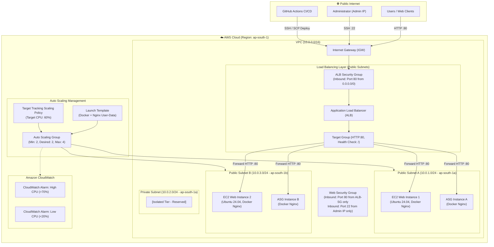

# 🚀 Production-Ready AWS Infrastructure with Terraform


A production-grade, highly available, and secure AWS infrastructure provisioned entirely as **Infrastructure as Code (IaC)** using **Terraform**. The architecture features a custom multi-AZ VPC, containerized Nginx application with **Docker**, traffic distribution via an **Application Load Balancer (ALB)**, dynamic scaling with an **Auto Scaling Group (ASG)** based on **CPU Target Tracking**, automated **CI/CD with GitHub Actions**, and infrastructure observability via **Amazon CloudWatch**.

> **Note on Infrastructure Lifecycle & Cost Management**:
> All AWS resources were successfully provisioned, integrated, end-to-end tested, and validated. Following comprehensive validation and evidence capture, all cloud resources were destroyed (`terraform destroy`) to avoid ongoing AWS billing. This repository serves as a fully tested, reproducible codebase and portfolio implementation.

---

## 📌 Architecture Overview

The infrastructure is deployed in the AWS `ap-south-1` (Mumbai) region across two availability zones (`ap-south-1a` and `ap-south-1b`) to ensure fault tolerance and high availability.

### Mermaid Architecture Diagram



### ASCII Architecture

```text
                                  Internet
                                     |
                                     v
                        +--------------------------+
                        |  Internet Gateway (IGW)  |
                        +------------+-------------+
                                     |
                                     v
                        +--------------------------+
                        |  Application Load        |
                        |  Balancer (ALB)          |
                        +------------+-------------+
                                     |
                              Target Group (Port 80)
                                     |
                   +-----------------+-----------------+
                   |                                   |
                   v                                   v
        +-----------------------+           +-----------------------+
        | Public Subnet A       |           | Public Subnet B       |
        | (10.0.1.0/24)         |           | (10.0.3.0/24)         |
        | - EC2 Web Server 1    |           | - EC2 Web Server 2    |
        | - ASG Dynamic Node    |           | - ASG Dynamic Node    |
        +-----------------------+           +-----------------------+
                   \                                   /
                    +-----------------+---------------+
                                      |
                           Auto Scaling Group (ASG)
                           Min: 2 | Desired: 2 | Max: 4
                                      |
                           CPU Target Tracking (60%)
                                      |
                                      v
                             Amazon CloudWatch
                          Metric Alarms (High/Low)
```

---

## 🌟 Key Features

* **Infrastructure as Code (IaC)**: 100% automated AWS resource provisioning using declarative Terraform configurations.
* **High Availability & Multi-AZ**: Distributed across `ap-south-1a` and `ap-south-1b` to eliminate single points of failure.
* **Layer 7 Load Balancing**: AWS Application Load Balancer (ALB) with Target Group health checks (`/` path, 30s interval) to automatically route traffic only to healthy targets.
* **Dynamic Auto Scaling**: Auto Scaling Group (ASG) with a Launch Template and Target Tracking policy maintaining average CPU utilization at 60%.
* **Security Hardening**:
  * Dual-layer Security Group architecture: The Web Security Group only accepts HTTP traffic originating from the ALB Security Group.
  * Restricted SSH access (Port 22) strictly locked down to the administrator's IP address (`/32`).
* **Containerization**: Application containerized using Docker with a lightweight `nginx:alpine` base image.
* **CI/CD Automation**: GitHub Actions pipeline triggering on push to `main` for SSH authentication and zero-downtime container redeployment.
* **Proactive Monitoring**: Amazon CloudWatch alarms configured for High CPU (>70%) and Low CPU (<20%) thresholds.

---

## 🛠️ Tech Stack

| Domain | Technology / Service | Description |
|---|---|---|
| **Cloud Provider** | AWS (Amazon Web Services) | Core cloud infrastructure provider |
| **Region** | `ap-south-1` (Mumbai) | Primary deployment region |
| **IaC** | Terraform (`~> 6.0` AWS provider) | Declarative infrastructure management |
| **Compute** | Amazon EC2 (`t3.micro`) | Ubuntu 24.04 LTS instances |
| **Networking** | AWS VPC | Custom VPC, 2 Public Subnets, 1 Private Subnet, IGW, Route Tables |
| **Load Balancing** | AWS Application Load Balancer (ALB) | HTTP Layer 7 load balancer & Target Group |
| **Scaling** | AWS Auto Scaling Group (ASG) | Multi-AZ ASG with Launch Template & Target Tracking |
| **Monitoring** | Amazon CloudWatch | Metric Alarms (`CPUUtilization`) |
| **Containers** | Docker (`nginx:alpine`) | Containerized web application |
| **CI/CD** | GitHub Actions | Automated build and deployment workflow |
| **Version Control** | Git & GitHub | Source code & configuration versioning |

---

## 📦 AWS Resources Managed by Terraform

The Terraform codebase provisions the following resources:

```text
├── Networking
│   ├── aws_vpc.main (10.0.0.0/16)
│   ├── aws_subnet.public (10.0.1.0/24 in ap-south-1a)
│   ├── aws_subnet.public_b (10.0.3.0/24 in ap-south-1b)
│   ├── aws_subnet.private (10.0.2.0/24 in ap-south-1a)
│   ├── aws_internet_gateway.main
│   ├── aws_route_table.public
│   ├── aws_route_table_association.public
│   └── aws_route_table_association.public_b
│
├── Security
│   ├── aws_security_group.alb (Inbound 80 from 0.0.0.0/0)
│   └── aws_security_group.web (Inbound 80 from alb-sg, Inbound 22 from Admin IP)
│
├── Compute & Load Balancing
│   ├── aws_instance.web (Public Subnet A)
│   ├── aws_instance.web_2 (Public Subnet B)
│   ├── aws_lb.app (Application Load Balancer)
│   ├── aws_lb_target_group.app (Target Group with health checks)
│   ├── aws_lb_listener.app (HTTP Port 80 forwarder)
│   ├── aws_lb_target_group_attachment.web_1
│   └── aws_lb_target_group_attachment.web_2
│
├── Auto Scaling
│   ├── aws_launch_template.web (Bootstrap User-Data script)
│   ├── aws_autoscaling_group.web (Min: 2, Desired: 2, Max: 4)
│   └── aws_autoscaling_policy.cpu_target_tracking (Target: 60% CPU)
│
└── Monitoring
    ├── aws_cloudwatch_metric_alarm.high_cpu (CPU > 70%)
    └── aws_cloudwatch_metric_alarm.low_cpu (CPU < 20%)
```

---

## 📂 Project Directory Structure

```text
terraform-aws-production-infrastructure/
├── .github/
│   └── workflows/
│       └── deploy.yml              # GitHub Actions CI/CD deployment pipeline
├── app/
│   ├── Dockerfile                  # Nginx Alpine container definition
│   └── index.html                  # Responsive modern HTML5 landing page
├── diagrams/
│   └── architecture.md             # Visual and textual architecture specifications
├── docs/
│   ├── deployment-guide.md         # Comprehensive deployment and reproduction guide
│   └── interview-notes.md          # Technical Q&A and architecture review notes
├── screenshots/                    # Complete implementation evidence (Phases 1-10)
│   ├── phase-1-networking/
│   ├── phase-2-ec2/
│   ├── phase-3-terraform/
│   ├── phase-4-app/
│   ├── phase-5-cicd/
│   ├── phase-6-alb/
│   ├── phase-7-autoscaling/
│   ├── phase-8-security/
│   ├── phase-9-monitoring/
│   └── phase-10-validation/
├── terraform/
│   ├── main.tf                     # Core Terraform infrastructure definitions
│   ├── variables.tf                # Input variable declarations
│   ├── outputs.tf                  # Infrastructure output definitions
│   ├── provider.tf                 # Terraform & AWS provider configuration
│   └── terraform.tfstate.backup    # State backup capturing validated deployment
├── LICENSE                         # Project license
└── README.md                       # Project documentation
```

---

## 🚀 Deployment & Terraform Workflow

### Prerequisites

Ensure you have installed and configured:

* [AWS CLI](https://aws.amazon.com/cli/) (`aws configure` with valid IAM credentials)
* [Terraform](https://www.terraform.io/) (v1.14+ recommended)
* [Docker](https://www.docker.com/)
* SSH Key Pair created in AWS (`devops-key`)

### Execution Commands (Reference)

```bash
# 1. Navigate to the terraform directory
cd terraform

# 2. Initialize provider plugins and modules
terraform init

# 3. Format and validate configuration syntax
terraform fmt
terraform validate

# 4. Generate and review execution plan
terraform plan

# 5. Provision the infrastructure
terraform apply -auto-approve

# 6. Inspect outputs
terraform output

# 7. Destroy infrastructure when finished (Cost Optimization)
terraform destroy -auto-approve
```

> ⚠️ **Note**: The infrastructure is currently in a destroyed state. The above commands are provided for reproducing the environment.

---

## 🔄 CI/CD Pipeline (GitHub Actions)

The repository includes an automated continuous deployment workflow (`.github/workflows/deploy.yml`):

1. **Trigger**: Automatically executes on every `git push` to branch `main`.
2. **Authentication**: Uses repository secrets (`EC2_SSH_KEY`, `EC2_HOST`, `EC2_USERNAME`) to establish a secure SSH connection with the EC2 host.
3. **Synchronization**: Securely copies the `app/` directory contents via `scp`.
4. **Build & Run**:
   - Stops and removes any previously running container (`docker rm -f production-app`).
   - Builds a fresh Docker image (`production-infrastructure:latest`).
   - Starts a new detached container on port 80 (`docker run -d -p 80:80 ...`).
   - Verifies container status via `docker ps`.

---

## ⚖️ Load Balancing & Auto Scaling Details

### Application Load Balancer
* **Type**: Internet-facing Layer 7 Application Load Balancer.
* **Subnets**: Deployed across `10.0.1.0/24` (AZ-a) and `10.0.3.0/24` (AZ-b).
* **Target Group**: HTTP Port 80 with health checks:
  * Path: `/`
  * Interval: 30s
  * Timeout: 5s
  * Healthy Threshold: 2
  * Unhealthy Threshold: 2

### Auto Scaling Group & Scaling Policy
* **Capacity**: Minimum: 2, Desired: 2, Maximum: 4.
* **Health Check**: Configured with `ELB` health checks to replace instances failing Target Group checks.
* **Target Tracking Policy**: Automatically scales in/out to maintain an average CPU utilization target of **60%** (`ASGAverageCPUUtilization`).

---

## 🔒 Security Hardening

```text
[ Internet (Anywhere) ]
          |
          | HTTP:80
          v
[ ALB Security Group (alb-sg) ]
          |
          | HTTP:80 (Restricted to alb-sg source only)
          v
[ Web Security Group (web-sg) ] <--- SSH:22 (Strictly locked to Admin IP/32)
          |
          v
[ EC2 & ASG Web Servers ]
```

1. **Direct Public Web Access Denied**: The EC2 web servers reject direct HTTP connections from the general internet; they only allow inbound port 80 traffic originating from the ALB Security Group ID.
2. **Locked Down SSH**: Inbound SSH (Port 22) is restricted exclusively to the administrator's static IP (`14.194.135.206/32`).
3. **Outbound Access**: Unrestricted egress allows servers to download OS updates and Alpine packages.

---

## 📊 Monitoring & Observability

Amazon CloudWatch monitors cluster health with two key alarms:

1. **High CPU Alarm (`terraform-aws-production-high-cpu`)**:
   * Metric: `CPUUtilization` (Namespace: `AWS/EC2`)
   * Threshold: `> 70%` for 2 consecutive 5-minute periods (Period: 300s).
   * Purpose: Alerts during sustained traffic spikes.
2. **Low CPU Alarm (`terraform-aws-production-low-cpu`)**:
   * Metric: `CPUUtilization` (Namespace: `AWS/EC2`)
   * Threshold: `< 20%` for 2 consecutive 5-minute periods (Period: 300s).
   * Purpose: Identifies underutilized capacity for cost optimization.

---

## 📸 Implementation & Validation Evidence

All 10 project phases were validated with evidence captured in `screenshots/`:

### 1. End-to-End Application Traffic via ALB


### 2. Healthy Target Group Registration


### 3. Final Terraform Infrastructure Plan


---

## 📋 Implementation Phases

| Phase | Description | Key Deliverables & Validation |
|:---:|---|---|
| **Phase 1** | AWS Networking Foundation | VPC (`10.0.0.0/16`), 2 Public Subnets, 1 Private Subnet, IGW, Route Table |
| **Phase 2** | EC2 Infrastructure & Docker | EC2 instance deployment, SSH verification, Docker installation & Nginx verification |
| **Phase 3** | Terraform IaC Conversion | Declarative Terraform provisioning, state management, resource creation |
| **Phase 4** | Application Containerization | HTML5 status landing page, `Dockerfile`, Docker image build and testing |
| **Phase 5** | GitHub Actions CI/CD | Pipeline configuration, SSH secrets integration, automated push-based deploy |
| **Phase 6** | Application Load Balancer | ALB provisioning, Target Group configuration, multi-instance health checks |
| **Phase 7** | Auto Scaling & Dynamic Policies | Launch Template, ASG (2-4 nodes), CPU Target Tracking policy at 60% |
| **Phase 8** | Security Hardening | Web SG restricted to ALB SG only, Admin IP lock for SSH |
| **Phase 9** | CloudWatch Monitoring | High CPU (>70%) and Low CPU (<20%) metric alarms |
| **Phase 10** | End-to-End Validation & Teardown | Full integration testing, screenshot evidence capture, safe teardown |

---

## 🔮 Future Architecture Improvements

For enterprise-scale production environments, potential enhancements include:

* **Remote State Management**: Migrate Terraform state to Amazon S3 with state locking via Amazon DynamoDB.
* **HTTPS / TLS Encryption**: Terminate SSL/TLS at the ALB using AWS Certificate Manager (ACM) with HTTP-to-HTTPS automatic redirection.
* **Custom Domain & DNS**: Route 53 latency/failover routing with alias records pointing to the ALB.
* **Edge Security**: Integrate AWS WAF (Web Application Firewall) on the ALB for rate limiting, bot control, and OWASP Top 10 protection.
* **ECR Container Registry**: Store and version Docker images in Amazon Elastic Container Registry (ECR) instead of on-host builds.
* **Private Subnet Placement with NAT Gateway**: Relocate all EC2/ASG instances to Private Subnets and use a NAT Gateway for outbound patch management.
* **Zero-Trust Access**: Replace port 22 SSH keys with **AWS Systems Manager (SSM) Session Manager**.
* **Alarm Notifications**: Integrate Amazon SNS with CloudWatch alarms for real-time Slack/Email alerts.

---

## 👤 Author

**Omkar Mahesh**
*B.Tech in Computer Science & Engineering (Cloud Computing & Automation)*
**Focus Areas:** DevOps • Cloud Infrastructure • AWS • Terraform • Docker • CI/CD Automation

* **GitHub:** [@omkarmm19](https://github.com/omkarmm19)
