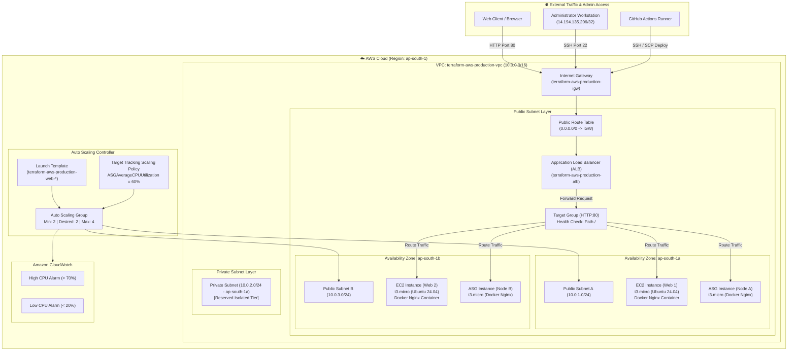
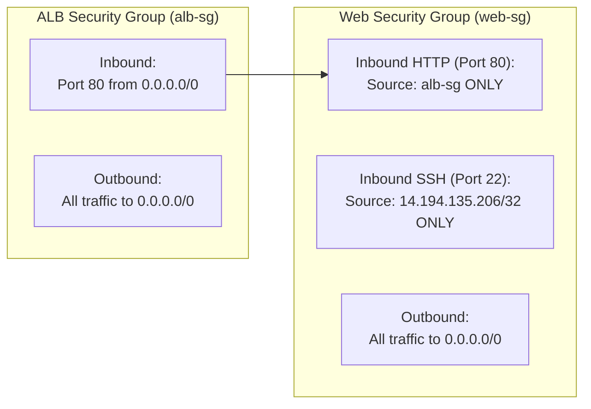

# 🏗️ AWS Infrastructure Architecture

This document details the architectural topology, networking tiers, traffic flow, and security boundaries implemented in this project using **Terraform** on **AWS**.

---

## 1. High-Level System Architecture

---

## 2. Network Topology & IP Addressing

| Resource Name | Subnet Tier | Availability Zone | CIDR Block | Purpose |
|---|---|---|---|---|
| **VPC** | Global | `ap-south-1` | `10.0.0.0/16` | Main virtual network container |
| **Public Subnet A** | Public | `ap-south-1a` | `10.0.1.0/24` | Web servers, ALB interface, ASG instances |
| **Public Subnet B** | Public | `ap-south-1b` | `10.0.3.0/24` | Multi-AZ redundancy for ALB and ASG |
| **Private Subnet** | Private | `ap-south-1a` | `10.0.2.0/24` | Isolated subnet tier |

---

## 3. Security Boundary & Traffic Isolation

Security Groups act as stateful virtual firewalls at the instance and ALB layers:

* **ALB Security Group (`alb-sg`)**:
  * Inbound: TCP Port 80 from `0.0.0.0/0` (Any IPv4 address).
  * Outbound: All traffic (`0.0.0.0/0`).
* **Web Security Group (`web-sg`)**:
  * Inbound HTTP: TCP Port 80 restricted **exclusively** to the `alb-sg` Security Group ID (No direct public HTTP access).
  * Inbound SSH: TCP Port 22 restricted **exclusively** to `14.194.135.206/32` (Administrator IP).
  * Outbound: All traffic (`0.0.0.0/0`).

---

## 4. Auto Scaling & Load Balancing Flow

1. **Traffic Entry**: External clients reach the ALB via its public DNS record.
2. **Health Verification**: The ALB performs HTTP health checks every 30 seconds to `/` on port 80. If an instance fails 2 consecutive health checks, it is removed from the target pool.
3. **Dynamic Scaling**:
   - The Auto Scaling Group maintains a minimum of 2 and maximum of 4 `t3.micro` instances.
   - The **Target Tracking Policy** queries CloudWatch metrics every minute.
   - If average ASG CPU utilization exceeds 60%, the ASG automatically scales out by launching new instances via the Launch Template.
   - If average CPU utilization drops below 60%, the ASG scales in to conserve resources.

---

## 5. Summary of Implemented Cloud Resources

* **1 VPC** with DNS Support and Hostnames enabled
* **3 Subnets** (2 Public across distinct AZs + 1 Private)
* **1 Internet Gateway** and **1 Public Route Table**
* **2 Security Groups** with chained security rules
* **2 Standalone EC2 Instances** (`t3.micro`)
* **1 Application Load Balancer** with **1 Target Group** and **1 HTTP Listener**
* **1 EC2 Launch Template** with automated Docker boot script
* **1 Auto Scaling Group** with **1 Target Tracking Scaling Policy**
* **2 CloudWatch Metric Alarms** (High CPU & Low CPU)
